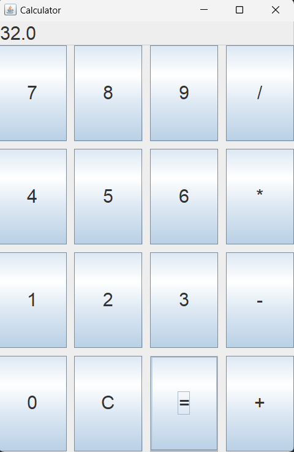

# Java GUI Calculator

This is a simple calculator application built using Java Swing for the graphical user interface (GUI). The calculator can perform basic arithmetic operations such as addition, subtraction, multiplication, and division.

## Features

- **Basic Operations**: Addition, subtraction, multiplication, and division.
- **Clear Display**: Clear the display using the 'C' button.
- **Error Handling**: Displays an error message for division by zero.

## Prerequisites

- Java Development Kit (JDK) installed on your machine. You can download it from [here](https://www.oracle.com/java/technologies/javase-jdk11-downloads.html).

## Screenshot


## Getting Started
## Contributing
  
Feel free to customize the sections such as "Clone the Repository," "Future Enhancements," and "Contact" with appropriate links, features, or contact information.


- Fork the repository.
- Create a new branch (git checkout -b feature-branch).
- Make your changes.
- Commit your changes (git commit -m 'Add some feature').
- Push to the branch (git push origin feature-branch).
- Open a pull request.

### Clone the Repository

```sh
git clone https://github.com/yourusername/Java-GUI-Calculator.git
cd Java-GUI-Calculator
javac CalculatorGUI.java
java CalculatorGUI


